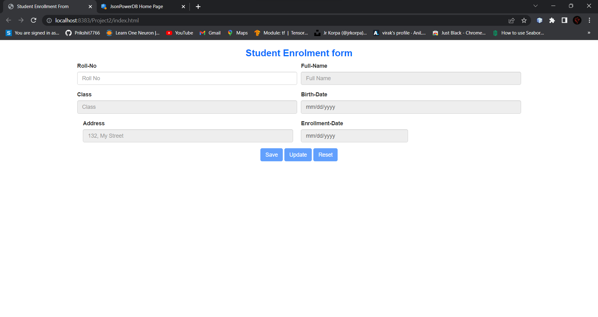
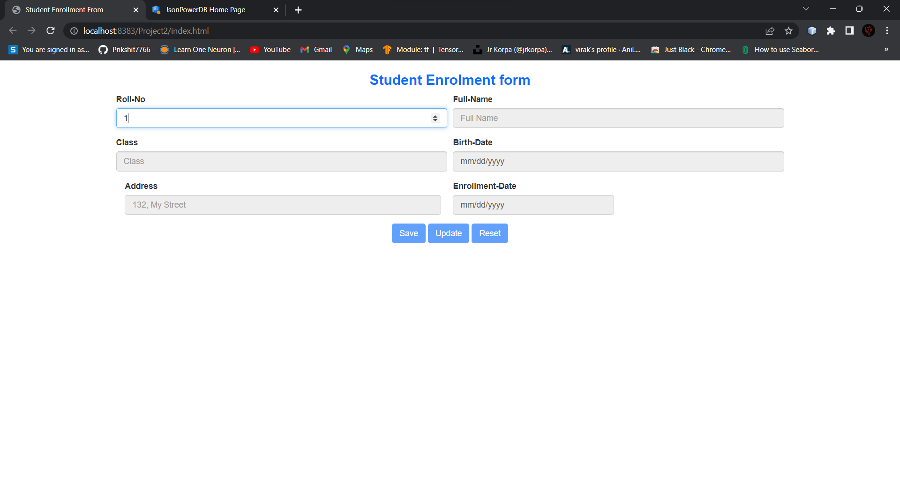
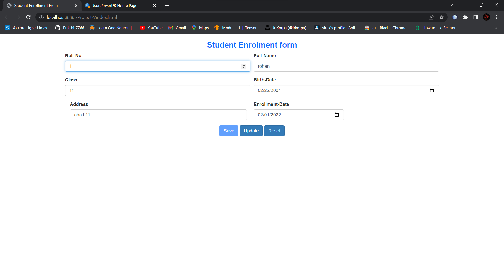
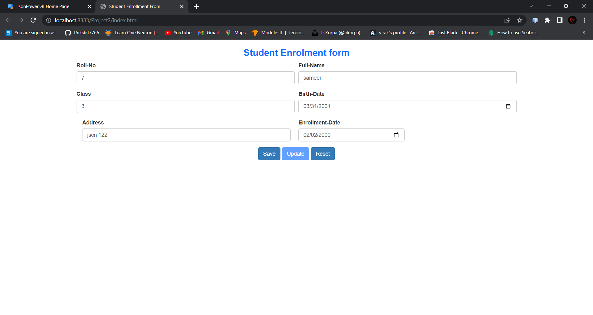
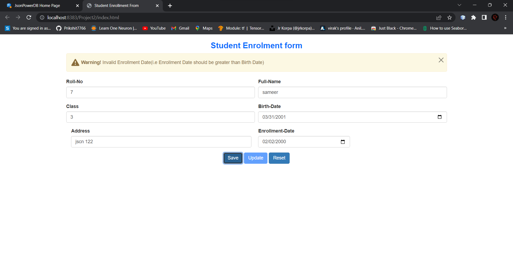
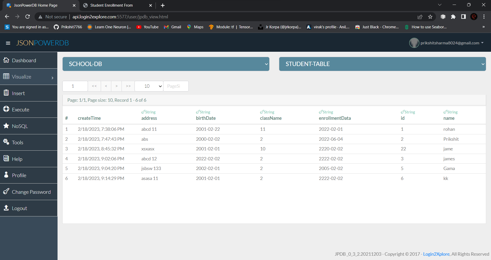

# Student Enrollment Form

## Home page
Screenshots:

  

enter a roll number
check if the roll number is available in the data base or not

  

If roll number is valid and that roll number is existnig in database

  

Adding new student data

  

  

If input data is not valid

  

  

  

